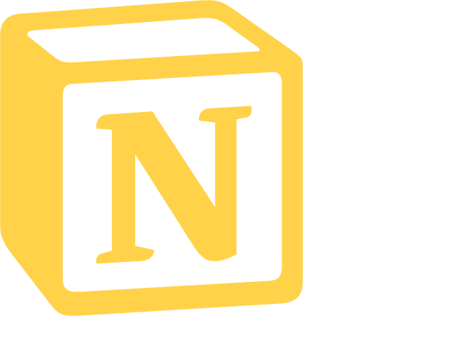

# Hi there! I’m Luiz  👋

[][linkedin]
[][gmail]
[][notion]

[linkedin]: https://www.linkedin.com/in/luiz-antonio-cruz/
[gmail]: luizantoniojcruz@gmail.com
[notion]:https://luizcruz.notion.site/Luiz-Cruz-51c32600c16b4c258a848df798e2d0a5

 
 

### I'm currently a Database student and here you'll find some of my projects on IoT, Data Analytics and other things.

### So welcome!

### Languages:

---
### DBMS:

---
### IDE's and DevOps

--
### Another Things

